# Projact User Guide

## Table of Contents
* [Introduction](#introduction)
* [About the User Guide](#about-this-user-guide)
    * [Key Terms](#key-terms)
        * [Contacts](#what-are-contacts)
        * [Tags](#wait-what-are-tags)
        * [Tasks](#how-about-tasks)
        * [Links](#and-links)
        * [Index](#index) 
    * [Symbols](#symbols)
* [Quick Start](#quick-start)
* [Features](#features)
    * [General](#general-features)
    * [Contact](#contact-features)
    * [Tag](#tag-features)
        * [Link](#link-features)
        * [Task](#task-features)
* [Command Summary](#command-summary)
    * [General](#general-commands)
    * [Contact](#contact-commands)
    * [Tag](#tag-commands)
    * [Link](#link-commands)
    * [Task](#task-commands)
* [FAQ](#faq)

--------------------------------------------------------------------------------------------------------------------

## Introduction
Welcome to the *Projact User Guide*!

#### Is Projact a typo?
Nope, Projact is a combination of Project and Contact!
It is a **project and contact management app that helps you, NUS computing students, to organise your fellow students' contacts by their modules or internship/work companies along with your project teams' meeting links and tasks**. 

Projact has been optimized for use via a Command Line Interface (CLI) so you can easily type all the commands. But no worries, there is still a Graphical User Interface (GUI) so you can see every change you make to your contacts, meeting links and tasks.

#### How does Projact work?
Projact stores:
- A list of the contacts you have added.
- A list of tags which you use to label your contacts. 

--------------------------------------------------------------------------------------------------------------------

## About this User Guide
This user guide provides in-depth documentation on the features in Projact to facilitate the effective organisation of your contacts. In addition, the quick start guide provides an end-to-end setup process to get you started. 

A basic understanding of how the Command Line Interface works would be good. However, a lack of it would not affect your experience with Projact as prior technical experience is not required.

Before you go on, here are some key terms and symbols you should know!

### Key Terms

#### What are Contacts?
- People whose information you store inside Projact are known as contacts. 
- Contacts contain the following information:
    - Name
    - Phone number
    - Email address
    - Telegram address
- You can also tag your contacts!
   
#### Wait, what are Tags?
- Tags are extremely customizable labels you can use to help organise your contacts. 
- Each contact can have any number of tags, from 0 to any number you assign it!
- Tags can store the following information:
    - Tasks
    - Links

#### How about Tasks?
- Ever forget what to-dos have been allocated to your project mates? Keep track of them by storing the to-dos as Tasks in Projact!
- Tasks are stored under a tag so you can easily categorise them.
- Whenever you or your project mates are done with their tasks, you can easily check them off and feel accomplished!

#### And Links?
- There are so many links floating around now and it's tough to keep track of them all. But don't worry, we've got your back!
- The link will be stored under a tag so it's easy to know what it's for. 

#### Index?
- Index refers to the contact's or tag's position in its list. You will need this to use many of the commands! But fret not, it's really easy to identify the index of your desired contact or tag. Find out more about this later on in the User Guide!

### Symbols

<!--suppress HtmlUnknownAttribute -->

 
   :information_source: This information symbol provides you with additional information.

 
 

 
   :bulb: This light bulb symbol will show you tips to make your Projact experience smoother.

 
 

 
   :exclamation: This exclamation mark symbol warns you about the command's input constraints or possible side effects.

 
 

Now you're prepared to embark on this journey and have Projact manage your contacts and projects.

--------------------------------------------------------------------------------------------------------------------

## Quick start

1. Ensure you have Java `11` or above installed in your Computer. Click [here](https://phoenixnap.com/kb/check-java-version-on-m…) to check if you have the correct version of Java installed. 

1. Download the latest `projact.jar` from [here](https://github.com/AY2021S1-CS2103T-T17-4/tp/releases/download/v1.3/projact.jar).

1. Copy the file to the folder you want to use as the _home folder_ for your Projact application.

1. Double-click the file to start the app. The GUI similar to the below should appear in a few seconds. Note how the app contains some sample data. 
   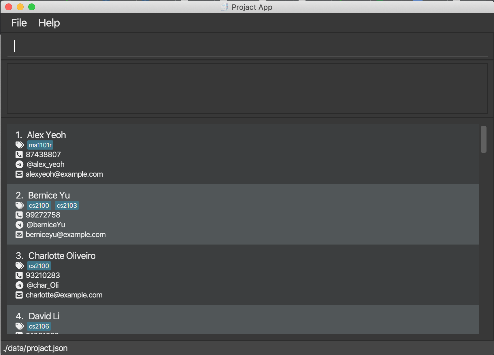

1. Type the command in the command box and press Enter to execute it. e.g. typing **`help`** and pressing Enter will open the help window. 
   Some example commands you can try:

   * **`list`** : Lists all contacts in the person list.

   * **`add`**`n/John Doe p/98765432 e/johnd@example.com ta/john_doe123` : Adds a contact named `John Doe` to the person list.

   * **`tagadd`**`t/CS210T` : Adds a permanent tag to the tag list.

   * **`delete`**`3` : Deletes the 3rd contact shown in the current person list.

   * **`tagdelete`**`1` : Deletes the tag of index 1 in the tag list.

   * **`clear`** : Deletes all contacts in the person list.

   * **`exit`** : Exits the app.

1. Refer to the [Features](#features) below for details of each command.

--------------------------------------------------------------------------------------------------------------------

## Features

**:information_source: Notes about the command format:** 

* Words in `UPPER_CASE` are the parameters to be supplied by the user. 
  e.g. in `add n/NAME`, `NAME` is a parameter which can be used as `add n/John Doe`.

* Items in square brackets are optional. 
  e.g `n/NAME [t/TAG]` can be used as `n/John Doe t/friend` or as `n/John Doe`.

* Items with `…`​ after them can be used multiple times including zero times. 
  e.g. `[t/TAG]…​` can be used as ` ` (i.e. 0 times), `t/friend`, `t/friend t/family` etc.

* Parameters can be in any order. 
  e.g. if the command specifies `n/NAME p/PHONE_NUMBER`, `p/PHONE_NUMBER n/NAME` is also acceptable.
  
* `INDEX` refers to the contact's position in `list` or the tag's position in `taglist`. `INDEX` must be a positive integer number!

### General Features

#### Viewing help : `help`

Shows a message explaining how to access the help page.

Format: `help`

#### Clearing all entries : `clear`

Clears all contact entries from the person list in Projact.

Format: `clear`

#### Exiting the program : `exit`

Exits Projact application.

Format: `exit`

#### Saving the data

Projact data are saved in the hard disk automatically after any command that changes the data. There is no need to save manually.

### Contact Features

#### Adding a contact: `add`

Adds a contact to the person list.

Format: `add n/NAME p/PHONE_NUMBER e/EMAIL ta/TELEGRAM_ADDRESS [t/TAG]…​`

:information_source: <b>Note:</b>

* No two contacts can have the same name

* Phone numbers can be 7 to 15 digits long.

 

:bulb: <b>Tip:</b>

* Numbers and underscores are allowed in a person's name so that you could set it to your contact's nickname.

* A person can have any number of tags since he/she is able to take more than one module with the user. (including 0)

* Listed tags will be created automatically if they are not found in the tag list.

Examples:
* `add n/John Doe p/98765432 e/johnd@example.com ta/john_doe123`
* `add n/Betsy Crowe t/friend e/betsycrowe@example.com ta/betsycr0w p/1234567 t/CS2101`

#### Listing all contacts : `list`

Shows a list of all the contacts in the person list.

Format: `list`

#### Editing a contact : `edit`

Edits the contact details of an existing contact in the person list.

Format: `edit INDEX [n/NAME] [p/PHONE_NUMBER] [e/EMAIL] [ta/TELEGRAM_ADDRESS] [t/TAG]…​`

* Edits the contact at the specified `INDEX`. The index refers to the index number shown in the displayed person list. The index **must be a positive integer** 1, 2, 3, …​
* At least one of the optional fields must be provided.
* Existing values will be updated to the input values.
* When editing tags, the existing tags of the contact will be removed i.e adding of tags is not cumulative.
* You can remove all the contact’s tags by typing `t/` without
    specifying any tags after it.

Examples:
*  `edit 1 p/91234567 e/johndoe@example.com` Edits the phone number and email address of the 1st contact to be `91234567` and `johndoe@example.com` respectively.
*  `edit 2 n/Betsy Crower t/` Edits the name of the 2nd contact to be `Betsy Crower` and clears all existing tags.
*  `edit 2 t/CS2103T` Edits the tag of the 2nd contact to only contain the module CS2103T tag.

#### Locating contacts by name: `find`

Do you have too many contacts such that you are unable to look for the contact you need? 
Use our `find` command to look for that contact using words that his/her name contains.

**Format:** `find KEYWORD [MORE_KEYWORDS]`

:information_source: **Note:**

* The search is case-insensitive. e.g `hans` will match `Hans`

* The order of the keywords does not matter. e.g. `Hans Bo` will match `Bo Hans`.

* Only the name is searched.

* Only full words will be matched e.g. `Han` will not match `Hans`.

 

:bulb: **Tip:**

* Type more than one keyword to find more than one contact each time! e.g. `Hans Bo` will return `Hans Gruber`, `Bo Yang`

**Example Guide:**
1. If you want to find `Alex Yeoh`, type `find Alex` or `find Yeoh`. The display result will be as shown.

2. If you want to find both `Alex Yeoh` and `David Li`, type `find alex david`. The display result will be as shown.

  
#### Sort contacts by name: `sort`

Dislike how the current list of contacts is displayed? Sort the names in ascending number then alphabetical order by 
typing a single `sort` word on the command line.

:bulb: **Tip:**

Do you wish to get back to the previous list? No worries, this sorted list is not permanent! 
Simply enter `list` on the command line to get back to the chronological order.

 

:information_source: **Note:**

1. Do note that `sort` command does not sort the contact list displayed after `find` command!

1. Only edit the contact based on the **Actual Index** as displayed!
    

 
 
**Format:** `sort`
 
**Step-By-Step Guide:**

Step 1: Key in the `sort` command.
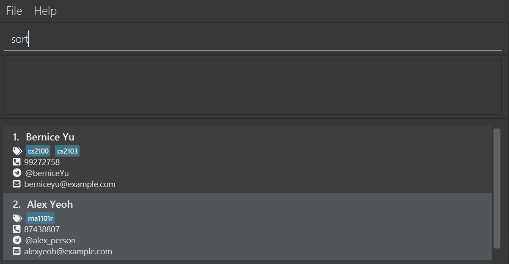

Step 2: Hit enter and the list with all the contact names will be sorted immediately as shown.
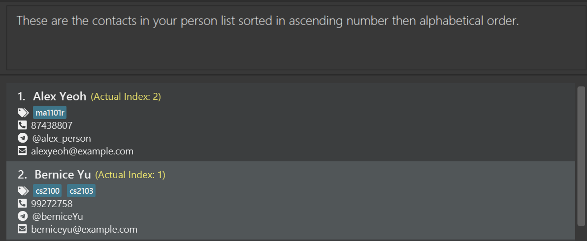

Step 3: If you want to edit 'Alex Yeoh', use the actual index **2** instead of 1. For example, `edit 2 t/cs1010` will
change the tag 'ma1101r' to 'cs1010' under Alex.
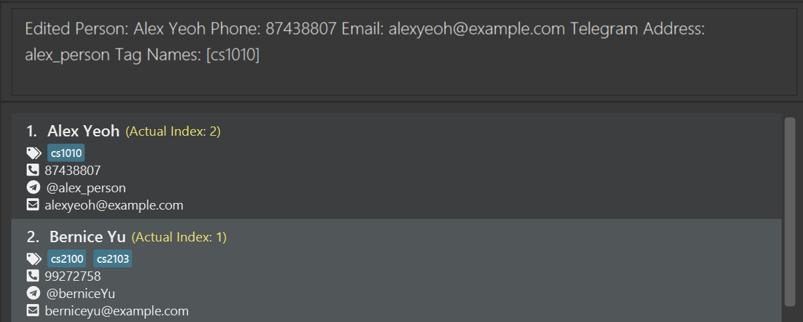

#### Deleting a contact : `delete`

Want to remove a contact? Simply use our `delete` command with the index `INDEX` of that contact shown in the displayed contact list!

**Format:** `delete INDEX`

:exclamation: **Warning:**
* If you have just used `sort`, follow the `Actual Index` as displayed to delete the particular contact you want!
* Delete the contact does not delete the respective tag(s). The name will be removed from the tag only!

**Example Guide**:

* `list` followed by `delete 2` deletes the 2nd contact in the person list.
   
   Step 1: This is the original list after using `list` command.
   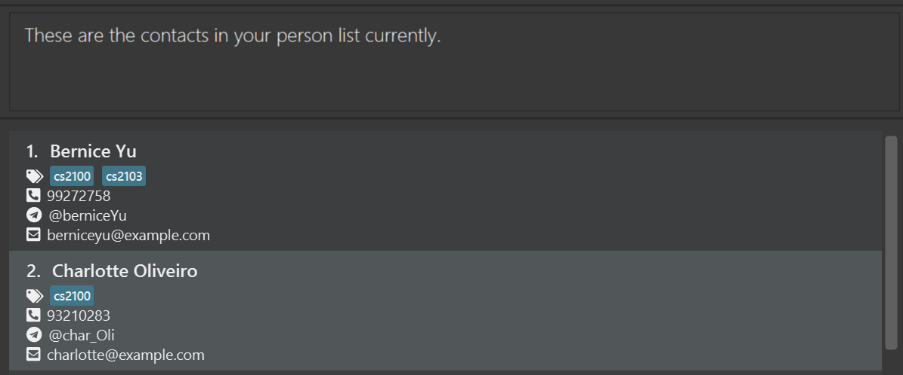
   
   Step 2: After entering `delete 2`, the contact Charlotte is deleted.
   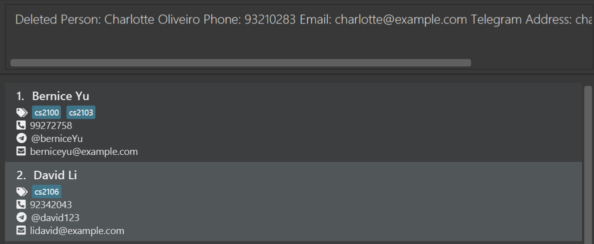
   
* `find Irfan` followed by `delete 1` deletes the 1st contact in the results of the `find` command.
   
   Step 1: This is the list after using the `find Irfan` command.
   
   
   Step 2: After entering `delete 1`, the contact Irfan is deleted.
   
   
* `sort` followed by `delete 1` deletes the 1st contact in the original contact list.
   
   Step 1: This is the list after using the `sort` command.
   
   
   Step 2: After entering `delete 1`, the contact David is deleted, not Alex Yeoh as the actual index of Alex is 3.
   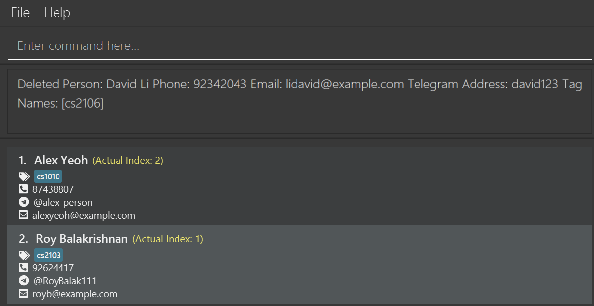   

### Tag Features

#### Adding a tag : `tagadd`

Adds a tag to the tag list.

Format: `tagadd t/TAG`

* Creates a specified tag without the need of a contact.
* Tag will not be created if it already exists in the tag list.

Examples:
* `tagadd t/CS2103T` creates a tag named CS2103T without assigning to any contact

#### Listing all tags: `taglist`

Want to see all the tags you have added? Display them with simply the `taglist` command.

**Format:** `taglist`
 
**Step-By-Step Guide:**

Step 1: Key in the `taglist` command.
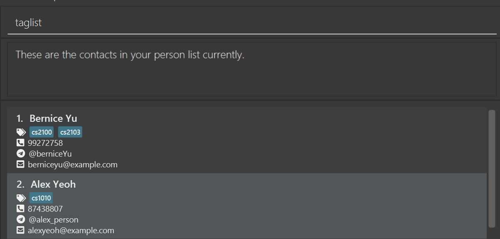

Step 2: Hit enter and the list with all the tags that you have added will be displayed immediately as shown.
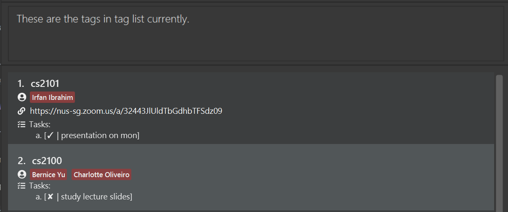

#### Editing a tag : `tagedit`

Made a mistake while adding tags? We got you! Here's a simple `tagedit` command to quickly fix your typos.

**Format**: `tagedit INDEX t/TAG_NAME`

**Step-By-Step Guide:**

Step 1: Key in `taglist` and hit enter to display all the tags. Then, scroll until you find the tag you want to edit.
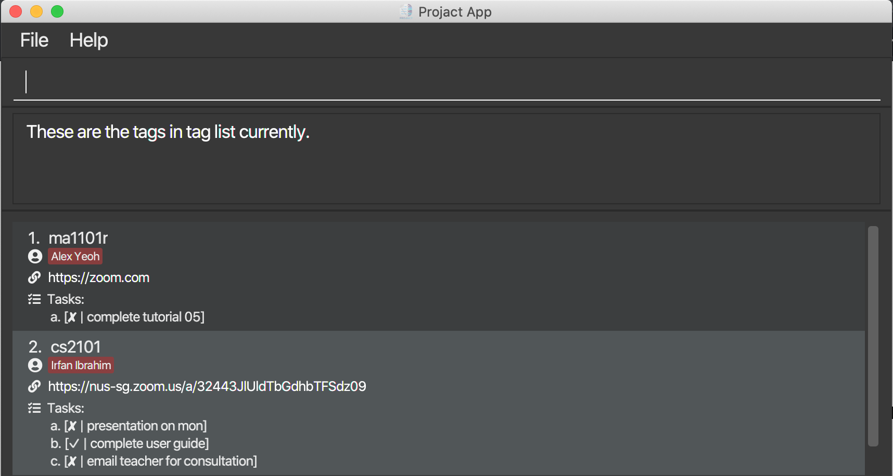

Step 2: For example, if you want to change the name of the `family` tag to `brother`, then key in `tagedit 4 t/brother` and hit enter.
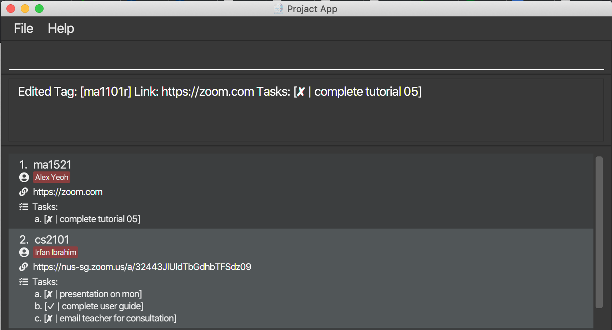

Step 3: You should see the tag's name being edited. Everyone who had the old tag will also have it renamed.
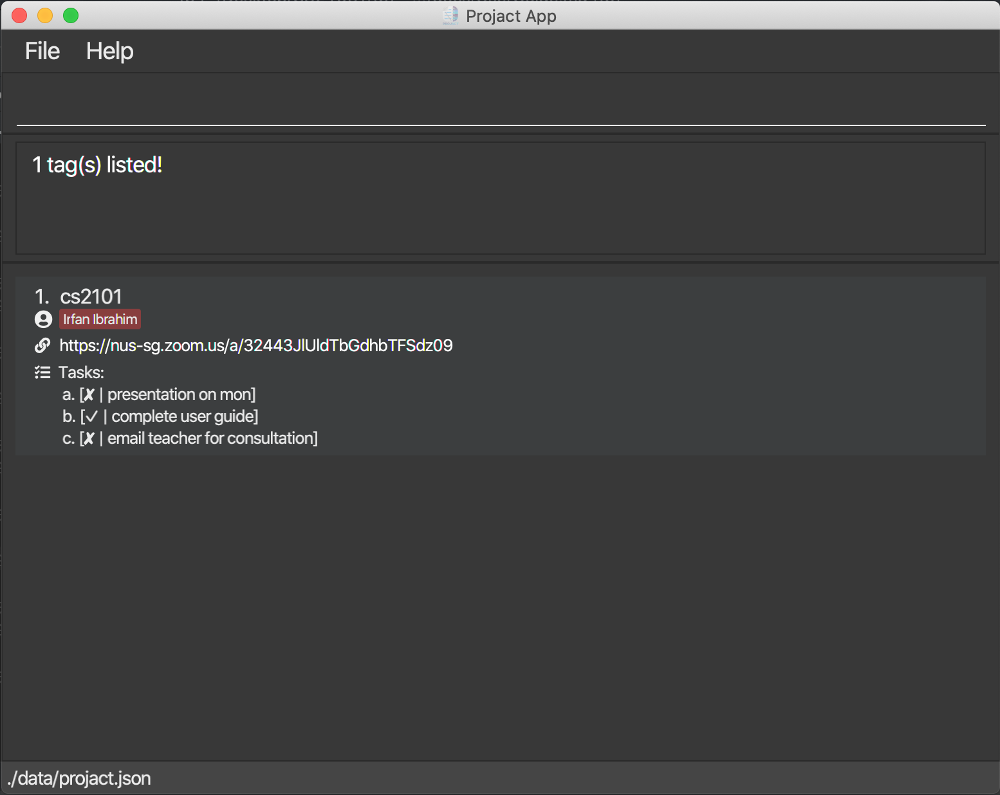

**:exclamation: Note:** 
* The index **must be a positive integer** 1, 2, 3, …​

#### Locating tags by name: `tagfind`

Finds the tags whose names contain any of the given keywords.

Format: `tagfind KEYWORD [MORE_KEYWORDS]`

* The search is case-insensitive. e.g `friends` will match `Friends`
* The order of the keywords does not matter. e.g. `Team1 GroupA` will match `GroupA Team1`
* Only the name is searched.
* Only full words will be matched e.g. `Team` will not match `Team1`
* Contacts matching at least one keyword will be returned (i.e. `OR` search).
  e.g. `Team A` will return `Team B`, `Group A`

Examples:
* `tagfind Group` returns `group` and `Group A`
* `tagfind Team B` returns `Team A`, `Group B` 

#### Sorting tags by tag name: `tagsort`

Dislike how the current list of tags is displayed? 
Sort the tags by their names in ascending number then in alphabetical order by typing a single `tagsort` word on the command line.

:bulb: **Tip:**
Do you wish to get back to the previous tag list? No worries, this sorted tag list is not permanent! Simply enter `taglist` on the command line to get back to the chronological order.

 :information_source: **Note:**
    1. Do note that `tagsort` command does not sort the tag list displayed after `tagfind` command!
    2. Only edit the tag based on the **Actual Index** as displayed! (Similar to `sort` command!)

**Format:** `tagsort`
 
**Step-By-Step Guide:**

Step 1: Key in the `tagsort` command.
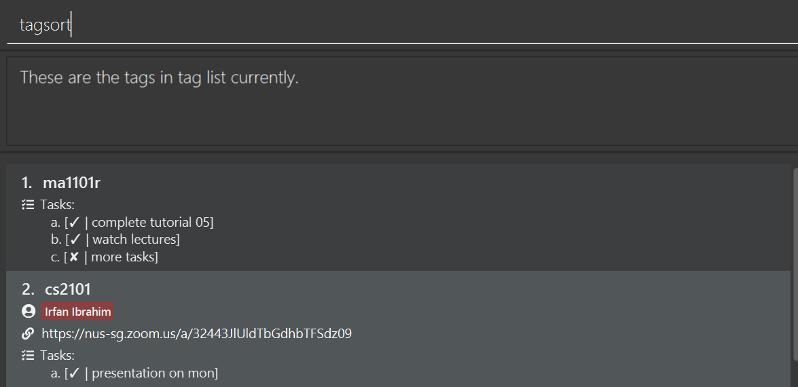

Step 2: Hit enter and the list with all the tag names will be sorted immediately as shown.

#### Deleting a tag: `tagdelete`

Want to get rid of a particular tag? Use the `tagdelete` command follow by the index `INDEX` of that tag from the tag list.

:exclamation: **Warning:**
The tag will also be removed from the contact(s) that contain(s) the tag.

**Format:** `tagdelete INDEX`

**Step-By-Step Guide:**

Step 1: First key in `taglist` and hit enter to display all the tags.
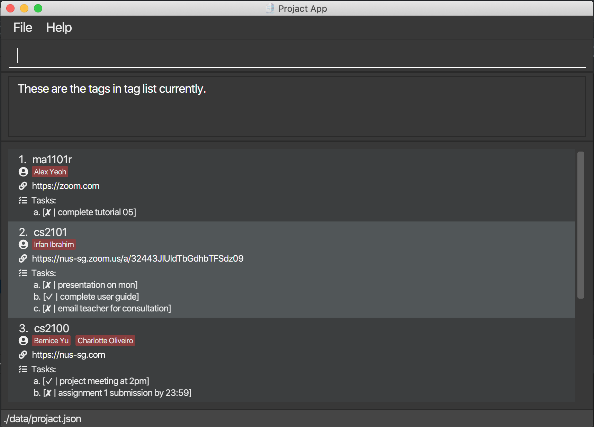

Step 2: For example, if you want to remove the "family" tag, key in `tagdelete 5` and hit enter.
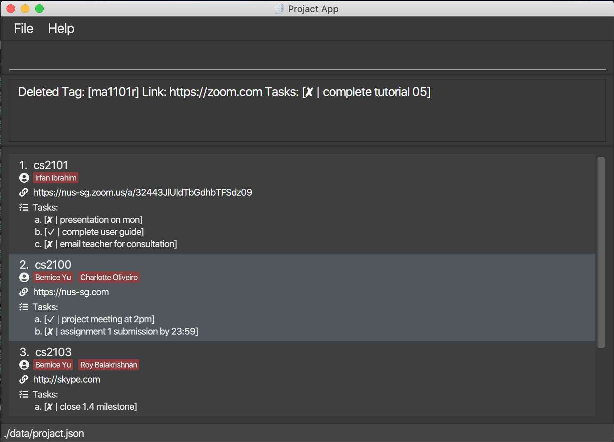

Step 3: You should see the updated tag list without the "family" tag.
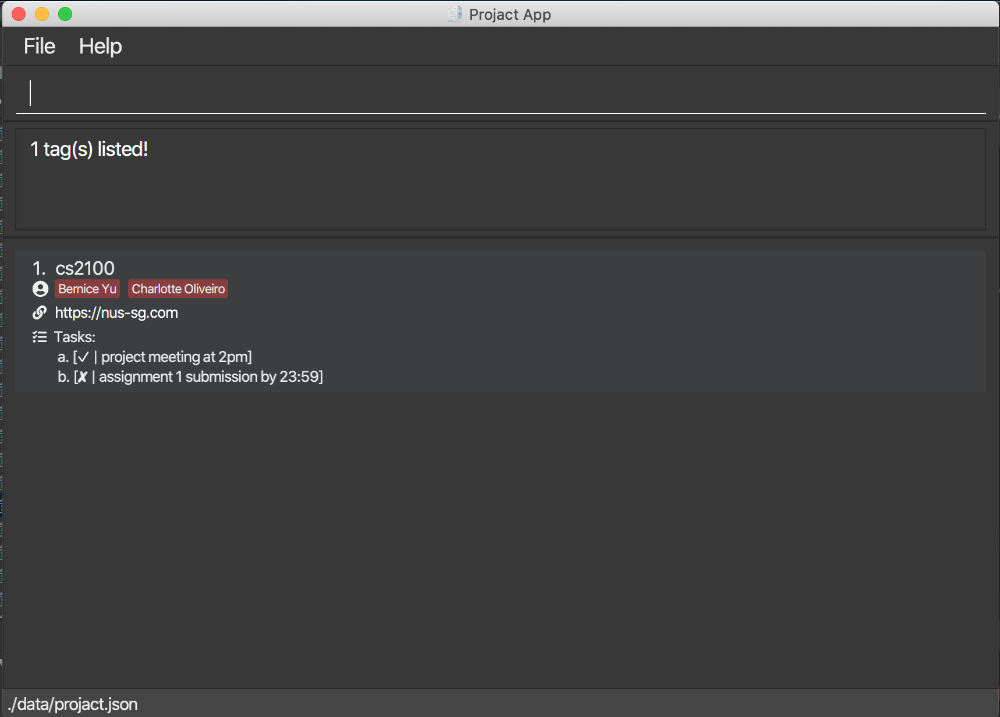

### Link Features

#### Adding a link under a tag: `linkadd`

This command ties a link to a specified tag. It will come in handy if you have group projects where you have a permanent platform that your group meets on (E.g. Zoom, Skype). However, do note that there can only be one link per tag.

**Format:** `linkadd INDEX l/LINK`

**Step-By-Step Guide:**

Step 1: First key in `taglist` and hit enter to display all the tags.
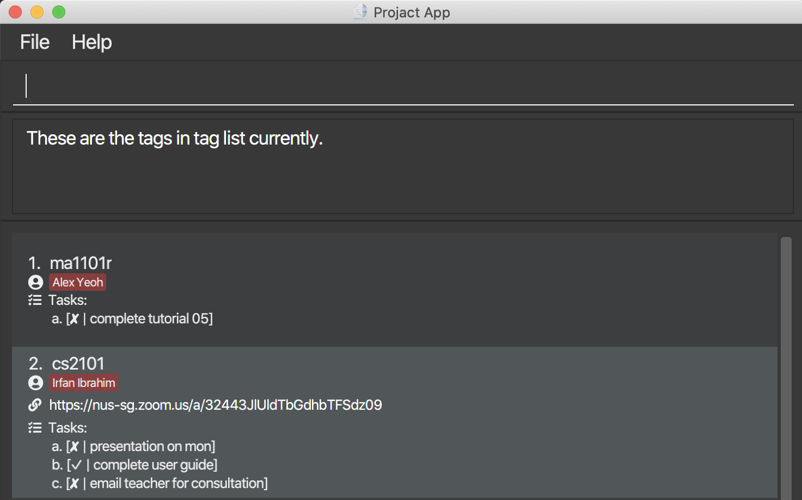

Step 2: For example, if you want to add a Skype meeting link to the "CS2103Project" tag, key in `linkadd 6 l/https://skype.com/cs2103proj/` and hit enter.

:exclamation: **Warning:**
Ensure that the link provided starts with either "https://" or "http://" and has top level domains such as ".com" and ".org".

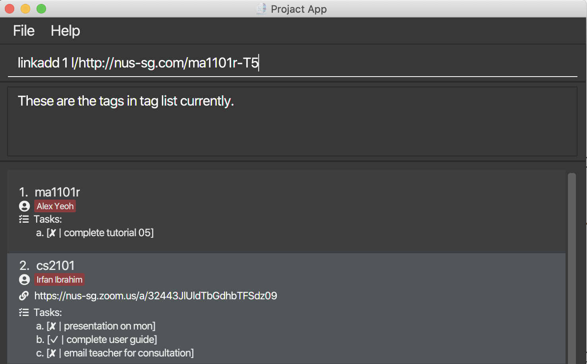

Step 3: You should see the link being added to the "CS2103Project" tag like this. 

:bulb: **Tip:**
Click on the link to be redirected to your browser!

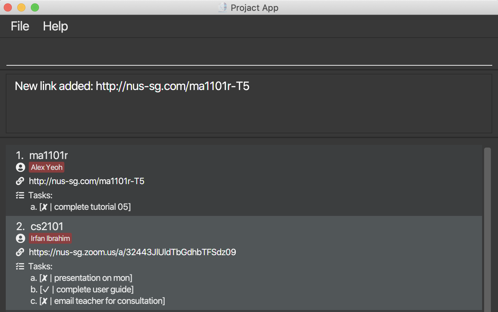

#### Deleting the link under the tag: `linkdelete`

Want to get rid of the link under a particular tag? Use the `linkdelete` command followed by the index `INDEX` of that tag from the tag list.
 
**Format:** `linkdelete INDEX`

**Step-By-Step Guide:**

Step 1: First key in `taglist` and hit enter to display all the tags. For example, if you want to remove the link from 
the "classmates" tag, key in `linkdelete 2` and hit enter.

Step 2: You should see the link being removed from the "cs2100" tag like this.
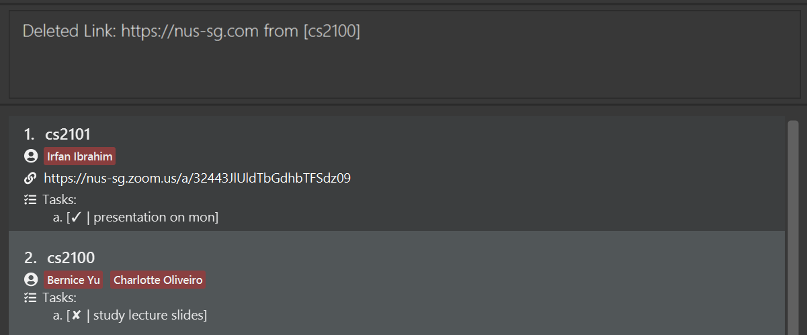

### Task Features

#### Adding a task: `taskadd`

Is there a specific task you want to add to a tag? Simply use the `taskadd` command followed by the index of that tag, and the name of the task!

**Format:** `taskadd INDEX task/TASK_NAME`

* Adds a task to the tag with the `INDEX` from the current view of the tag list after doing `taglist`.
* Task will not be added if specified tag with `INDEX` already has a task with the same task name.

**:information_source: Maximum number of tasks in each tag:** 

* Only a maximum of 26 tasks can be added, due to the alphabet being used as an index.

* Attempts to add additional tags after 26 will result in an error. 
  i.e. Unable to add new tasks after the task with index `z`.

Example:
* `taskadd 2 task/peer review` adds a task to the tag with the index 2 in the current tag list.

#### Marking a task under a tag as done: `taskdone`

After adding a task to your targeted tag, you must have seen the cross beside the task description. So how to mark the 
task as done once you have completed the task? Use `taskdone` followed by the index `INDEX` of the tag and 
the alphabetical index `ALPHAINDEX` to do the magic!

**Format:** `taskdone INDEX ALPHAINDEX`

**Step-By-Step Guide:**

Step 1: First key in `taglist` and hit enter to display all the tags.

Step 2: For example, if you want to mark the second task under the tag "CS2101" as done. Key in "taskdone 2 b" and hit enter.
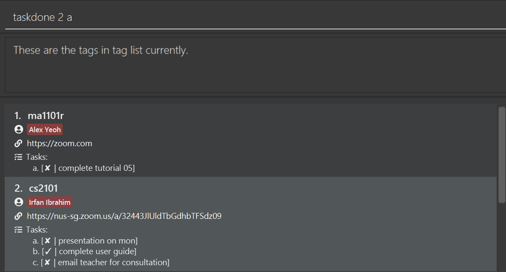

Step 3: You should see the task "complete user guide" have a tick beside it.
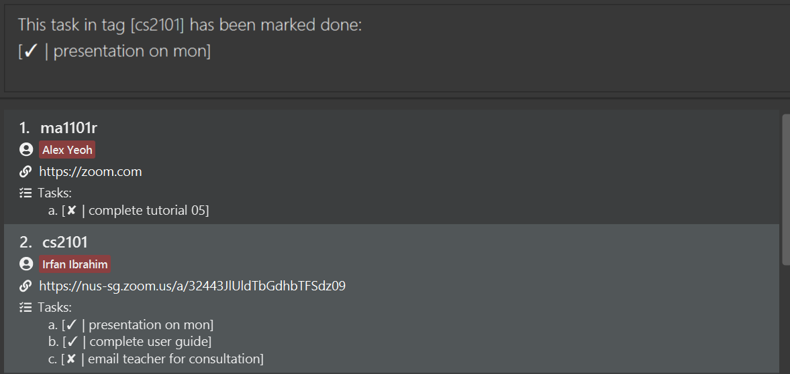

#### Deleting a task: `taskdelete`

Are the tasks added no longer needed? Or perhaps you accidentally added the wrong task to the wrong tag? Worry not! Use the `taskdelete` command followed by the index of that tag, and the alphabetical index of the task!

**Format:** `taskdelete INDEX ALPHAINDEX`

* Deletes a task to the tag with the `INDEX` from the currrent view of the tag list (either tagsort or taglist).

Example:
* `taskdelete 1 b` deletes the task with the alphabetical index b from the tag with the index 1 in the current tag list.

--------------------------------------------------------------------------------------------------------------------

## Command summary

### General commands

Action | Format, Examples
--------|------------------
**Help** | `help`
**Clear** | `clear`
**Exit** | `exit`

### Contact commands

Action | Format, Examples
--------|------------------
**Add** | `add n/NAME p/PHONE_NUMBER e/EMAIL ta/TELEGRAM_ADDRESS [t/TAG]…​`   e.g., `add n/James Ho p/22224444 e/jamesho@example.com ta/jamesHO t/CS2101 t/CS2103T`
**List** | `list`
**Edit** | `edit INDEX [n/NAME] [p/PHONE_NUMBER] [e/EMAIL] [ta/TELEGRAM_ADDRESS] [t/TAG]…​`  e.g., `edit 2 n/James Lee e/jameslee@example.com`
**Find** | `find KEYWORD [MORE_KEYWORDS]`  e.g., `find James Jake`
**Sort** | `sort`
**Delete** | `delete INDEX`  e.g., `delete 3`

### Tag commands

Action | Format, Examples
--------|------------------
**Tag Add** | `tagadd t/TAG`  e.g., `tagadd t/CS2103T`
**Tag List** | `taglist`
**Tag Edit**| `tagedit INDEX t/TAG_NAME`   e.g., `tagedit 1 t/CS2101`
**Tag Find** | `tagfind  KEYWORD [MORE_KEYWORDS]`  e.g., `tagfind friends colleagues`
**Tag Sort** | `tagsort`
**Tag Delete**| `tagdelete INDEX`   e.g., `tagdelete 1`

### Link commands

Action | Format, Examples
--------|------------------
**Link Add** | `linkadd INDEX l/LINK`   e.g, `linkadd 2 l/https://skype.com/cs2103proj/`
**Link Delete** | `linkdelete INDEX`  e.g., `linkdelete 1`

### Task commands

Action | Format, Examples
--------|------------------
**Task Add** | `taskadd INDEX task/TASK_NAME`  e.g., `taskadd 1 task/peer review`
**Task Delete** | `taskdelete INDEX ALPHAINDEX`  e.g., `taskdelete 1 b`
**Task Done** | `taskdone INDEX ALPHAINDEX`  e.g., `taskdone 1 c`

--------------------------------------------------------------------------------------------------------------------

## FAQ

**Q**: How do I transfer my data to another Computer? 
**A**: Copy all the current files generated by the application, together with `projact.jar` file and paste in an empty folder 
in the other computer. The data should remain the same as it was in your previous computer.

**Q**: I have tried double-clicking the `projact.jar` file but the application does not open.  
**A**: Please ensure that you have loaded the `projact.jar` file from our latest release on our github website. 
A temporary solution could be to open your Command Prompt (Windows OS) or terminal (MacOS) and key in `java -jar <path_of_file>`. 
For example, `java -jar C:\Users\name\projact\projact.jar`. We understand that this may be troublesome over time, so please 
drop an email at siqiang@comp.nus.edu.sg or raise an issue on our github page.

